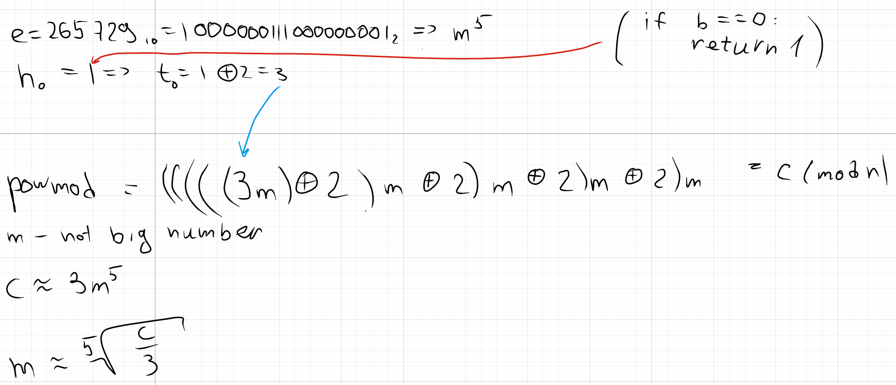

# First RSA (100pts)

## Description

Alice tried to implement RSA in Python the first time, but there is a critical bug preventing Alice from getting her flag back.

## Attachments

[file1](./chall.py)
[file2](./output.txt)

## Writeup

Analyzing `powmod` function, notice mistake:

`t = h ^ 2`

It should be `t = h ** 2`

Reasoning:

Solution:

[solution](./solution.sage)

`ictf{^_is_not_the_power_operator...}`
