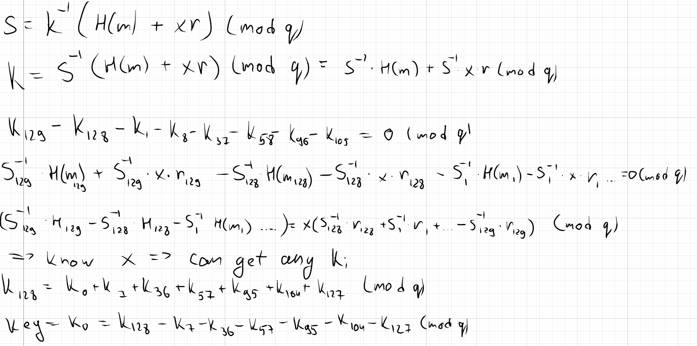

# Linear Feedback Shift Randomness (125pts)

## Description

The system random isn't random enough for my tastes! I made something 128 times as random, and signed fake flags with it.

## Attachments

[file1](main.py)
[file2](out.txt)

## Writeup

Main vuln is `__next__` method of `LFSR`: each next value of `k` depends on previous.

We can recover them all.

Proofs:

[solution](./solution.py)

`ictf{Th3_R_1n_LFSR_i5_N0T_f0r_r4nd0m}`
