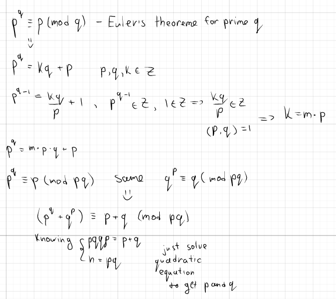

# pqqp (75pts)

## Description

Just RSA with an extra useless number that won't help you factoring it.

## Attachments

[file1](chall.py)
[file2](output.txt)

## Writeup

`ictf{can_you_proof_that_p^q+q^p_is_actually_p+q?}`
