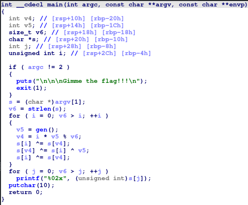
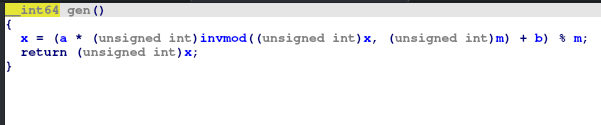
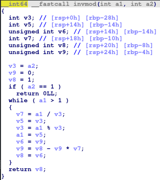
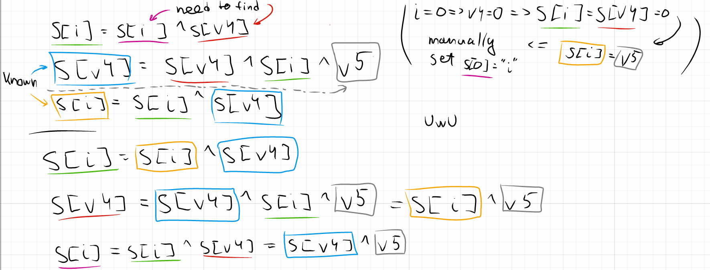

# Here's some Rev (75pts)

## Description

The only submitted challs were either too hard or too much crypto, so had to do something lest the players get bored.

## Attachments

[file1](test)
[file2](output.txt)

## Writeup

Reversing file `test` in function `main` see

Each char of flag xored with another char and generated value.

`gen` function:

Global variable `x` in each iteration changes value.

`invmod`:

So, we know first value of `x`. This means we can recover all other `x` values => all `v5` and `v4`.

Some simplifications:

To get falg we just need to run the loop backward.

Solution files:

[solution.c](solution.c) - recover all `v4` and `v5` values

[solution.py](solution.py) - recover flag

`ictf{w3_d1dn't_h4v3_t1m3_s0_h3r3's_4n_34sy_ch4l1._IDK_1m_n0t_4_r3v_p3r50n}`
